<style>
  body { font-family: Arial, sans-serif; max-width: 900px; margin: auto; padding: 2em; font-size: 11pt; line-height: 1.6; }
  h1 { page-break-before: always; color: #1a1a2e; }
  h1:first-of-type { page-break-before: avoid; }
  h2 { color: #16213e; border-bottom: 1px solid #ddd; padding-bottom: 4px; }
  h3 { color: #0f3460; }
  table { border-collapse: collapse; width: 100%; margin: 1em 0; font-size: 10pt; }
  th { background: #1a1a2e; color: white; padding: 8px; text-align: left; }
  td { padding: 6px 8px; border: 1px solid #ddd; }
  tr:nth-child(even) { background: #f9f9f9; }
  img { max-width: 100%; margin: 1em auto; display: block; }
  code { background: #f4f4f4; padding: 2px 6px; border-radius: 3px; font-size: 10pt; }
  pre { background: #f4f4f4; padding: 1em; border-radius: 5px; overflow-x: auto; font-size: 9.5pt; }
  .math { font-family: "Courier New", monospace; background: #f8f8f8; padding: 4px 10px; display: block; margin: 0.5em 0; border-left: 3px solid #2196F3; }
</style>

# Wprowadzenie

Celem projektu była implementacja i analiza algorytmów uczenia maszynowego
oraz sieci neuronowych **od zera**, bez korzystania z gotowych modeli z bibliotek.
Projekt zrealizowano w języku Python z wykorzystaniem biblioteki PyTorch
wyłącznie do operacji macierzowych i przechowywania tensorów.

Zaimplementowane modele:

- **Naiwny Bayes** — Categorical Naive Bayes z wygładzaniem Laplace'a
- **Drzewo decyzyjne** — kryterium Gini (klasyfikacja) i wariancja MSE (regresja)
- **Sieć dwuwarstwowa** — jawny forward/backward pass, mini-batch SGD
- **Sieć konwolucyjna** — klasyfikacja obrazów MNIST i CIFAR-10

Kod źródłowy dostępny pod adresem:
[github.com/MarcinLipowski/sieci-neuronowe-machine-learning](https://github.com/MarcinLipowski/sieci-neuronowe-machine-learning)

---

# Naiwny Bayes i Drzewo Decyzyjne

## Dataset — Subscribers

Dataset zawiera **1024 próbki** opisujące potencjalnych subskrybentów usługi.
Zadanie to **klasyfikacja binarna**: przewidzieć czy osoba zostanie subskrybentem
(`Subscribes`: 0/1) na podstawie czterech cech demograficznych.

| Cecha | Typ | Wartości |
|-------|-----|----------|
| Age | kategoryczna | senior, young adult, gen. X, adult |
| Sex | kategoryczna | M, F |
| Income | kategoryczna | low, average, high |
| Residence | kategoryczna | country, suburb, city |
| **Subscribes** | **target** | **0 (64.5%), 1 (35.5%)** |

Brak braków danych. Klasy lekko niezbalansowane (64.5% / 35.5%) —
zastosowano stratyfikację przy podziale train/test (80/20).

## Eksploracja danych

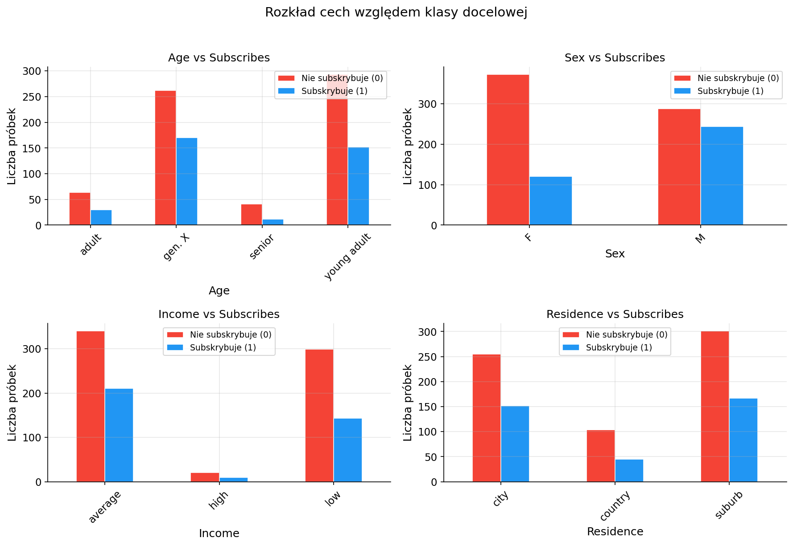

Żadna z cech nie wykazuje silnej korelacji z klasą docelową — rozkłady
klasy 0 i 1 są zbliżone dla każdej wartości każdej cechy.
Zapowiada to trudny problem klasyfikacyjny dla obu modeli.

## Naiwny Bayes — implementacja

Zaimplementowano **Categorical Naive Bayes** — wersję dla cech kategorycznych.
W odróżnieniu od Gaussian Naive Bayes, zamiast rozkładu normalnego używa
zliczania częstości z **wygładzaniem Laplace'a**:

<div class="math">P(cecha=v | c) = (count(v,c) + α) / (count(c) + α × |V|)</div>

gdzie `α=1` to parametr wygładzania Laplace'a, `|V|` to liczba unikalnych
wartości cechy. Wygładzanie zapobiega zerowemu prawdopodobieństwu dla wartości
niewidzianych w treningu.

Predykcja odbywa się w **przestrzeni logarytmów** dla stabilności numerycznej
(uniknięcie underflow przy mnożeniu małych prawdopodobieństw):

<div class="math">log P(c|x) ∝ log P(c) + Σᵢ log P(xᵢ | c)</div>

## Drzewo decyzyjne — implementacja

Zaimplementowano drzewo decyzyjne dla cech kategorycznych z kryterium
**Gini Impurity**:

<div class="math">Gini(S) = 1 - Σᵢ pᵢ²</div>

Każdy podział tworzy tyle gałęzi ile jest unikalnych wartości cechy.
Najlepsza cecha do podziału wybierana jest przez maksymalizację
information gain: `gain = Gini(rodzic) - Σ (|Sv|/|S|) × Gini(Sv)`.

Parametry: `max_depth=6`, `min_samples_split=5`.

## Wyniki i porównanie

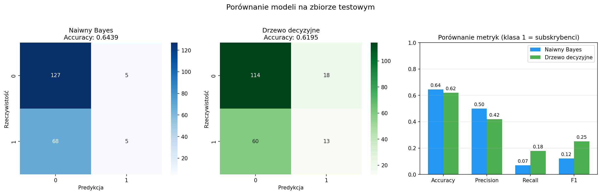

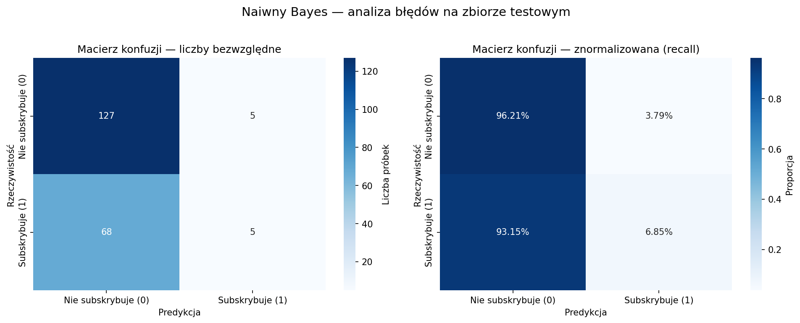

| Metryka | Naiwny Bayes | Drzewo decyzyjne |
|---------|-------------|-----------------|
| Accuracy | 0.6439 | 0.6195 |
| Precision (kl. 1) | 0.5000 | 0.4194 |
| Recall (kl. 1) | 0.0685 | 0.1781 |
| F1 (kl. 1) | 0.1205 | **0.2500** |
| Accuracy treningowe | 0.6593 | 0.6789 |

Oba modele osiągają accuracy równe proporcji klasy większościowej (64.5%),
co wskazuje na słabą siłę dyskryminującą dostępnych cech demograficznych.
Drzewo decyzyjne uzyskało wyższy **F1=0.25** dla klasy subskrybentów
dzięki zdolności do modelowania interakcji między cechami. Naiwny Bayes
zakłada niezależność cech — założenie to nie jest spełnione w tym datasecie.

---

# Sieci Dwuwarstwowe

Zaimplementowano sieć neuronową z jedną warstwą ukrytą bez użycia
`nn.Module`. Wszystkie obliczenia forward i backward są jawne —
PyTorch używany wyłącznie do operacji macierzowych.

**Architektura:** wejście → [warstwa ukryta: ReLU] → [wyjście: Sigmoid lub Linear]

**Forward pass:**

<div class="math">z₁ = X·W₁ᵀ + b₁,   a₁ = ReLU(z₁)</div>
<div class="math">z₂ = a₁·W₂ᵀ + b₂,  ŷ = σ(z₂)   [klasyfikacja]  lub  ŷ = z₂   [regresja]</div>

**Backward pass (reguła łańcuchowa):**

<div class="math">δ₂ = (ŷ - y) / N</div>
<div class="math">∂L/∂W₂ = δ₂ᵀ · a₁,   ∂L/∂b₂ = Σ δ₂</div>
<div class="math">δ₁ = (δ₂ · W₂) ⊙ ReLU'(z₁)</div>
<div class="math">∂L/∂W₁ = δ₁ᵀ · X,   ∂L/∂b₁ = Σ δ₁</div>

**Aktualizacja wag (SGD):** `W = W - lr × ∂L/∂W`

**Inicjalizacja Xavier:** `W ~ N(0, √(2/n_in))` — stabilizuje wariancję
aktywacji przez warstwy, zapobiega zanikającemu/eksplodującemu gradientowi.

## Problem XOR

XOR jest klasycznym problemem **nieliniowo separowalnym** — żadna prosta
linia nie oddziela klas 0 i 1. Wymaga co najmniej jednej warstwy ukrytej.

| x₁ | x₂ | XOR |
|----|----|----|
| 0 | 0 | 0 |
| 0 | 1 | 1 |
| 1 | 0 | 1 |
| 1 | 1 | 0 |

**Architektura:** 2 → 4 → 1 | **lr:** 0.05 | **Epoki:** 5000 | **Batch:** 4

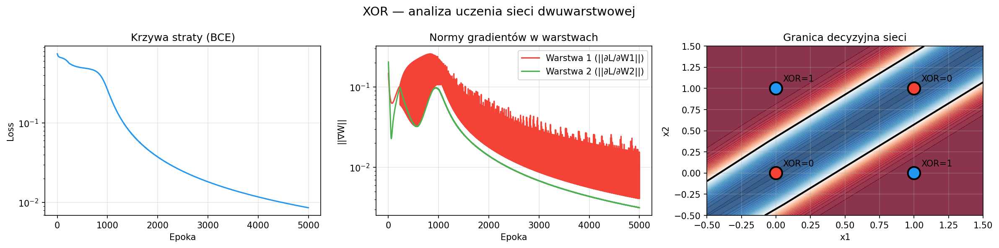

Sieć nauczyła się XOR po **~1000 epokach** (accuracy 100%). Granica
decyzyjna przyjęła kształt "pasa" — dwie równoległe linie liniowe tworzone
przez warstwę ukrytą, połączone przez warstwę wyjściową operacją AND.

Normy gradientów warstwy 1 oscylują silniej niż warstwy 2 — typowe zjawisko:
sygnał błędu słabnie przechodząc przez W₂ (zanikający gradient w głębszych
warstwach).

## Titanic — klasyfikacja binarna

**Dataset:** 891 pasażerów Titanica, 8 cech po preprocessingu.

**Preprocessing:**

- Braki w kolumnie `Age` (177/891) uzupełniono **medianą z danych treningowych** (28.5 lat) — zapobiega data leakage
- `Cabin` usunięto (77% braków)
- `Sex` zakodowano binarnie (male=1, female=0)
- `Embarked` zakodowano one-hot (2 kolumny binarne)
- Wszystkie cechy standaryzowane do N(0,1)

**Architektura:** 8 → 16 → 1 | **lr:** 0.01 | **Epoki:** 2000 | **Batch:** 32

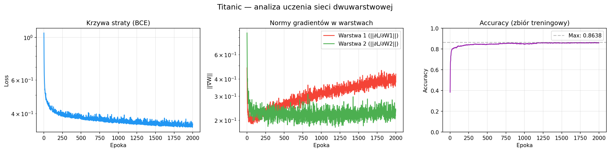

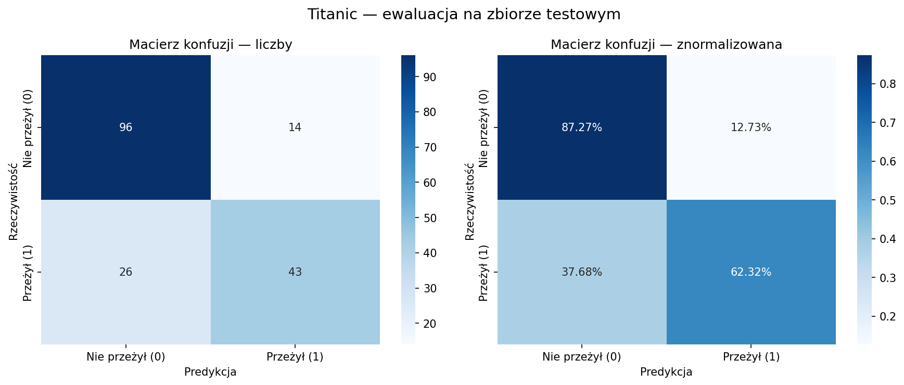

| Metryka | Nie przeżył (0) | Przeżył (1) |
|---------|----------------|-------------|
| Precision | 0.7869 | 0.7544 |
| Recall | 0.8727 | 0.6232 |
| F1 | 0.8276 | 0.6825 |
| **Accuracy** | **0.7765** | |

Model poprawnie sklasyfikował **139/179 pasażerów (77.65%)**. Recall klasy
"Przeżył" wynosi 62.32% — model przeoczyć prawie 4 na 10 ocalałych, co
wynika z niezbalansowania klas (61.6%/38.4%) i braku cech behawioralnych
w datasecie (kolejność wsiadania do szalup itp.).

## Boston Housing — regresja

**Dataset:** 506 próbek okolic Bostonu, 13 cech numerycznych,
target: mediana ceny domu w tys. $ (wartość ciągła).

**Architektura:** 13 → 32 → 1 (wyjście **liniowe**) | **Funkcja straty:** MSE

Kluczowa różnica względem klasyfikacji: wyjście sieci nie ma funkcji
aktywacji — neuron wyjściowy zwraca wartość ciągłą. Target normalizowany
do N(0,1) podczas treningu, odwracany przy ewaluacji.

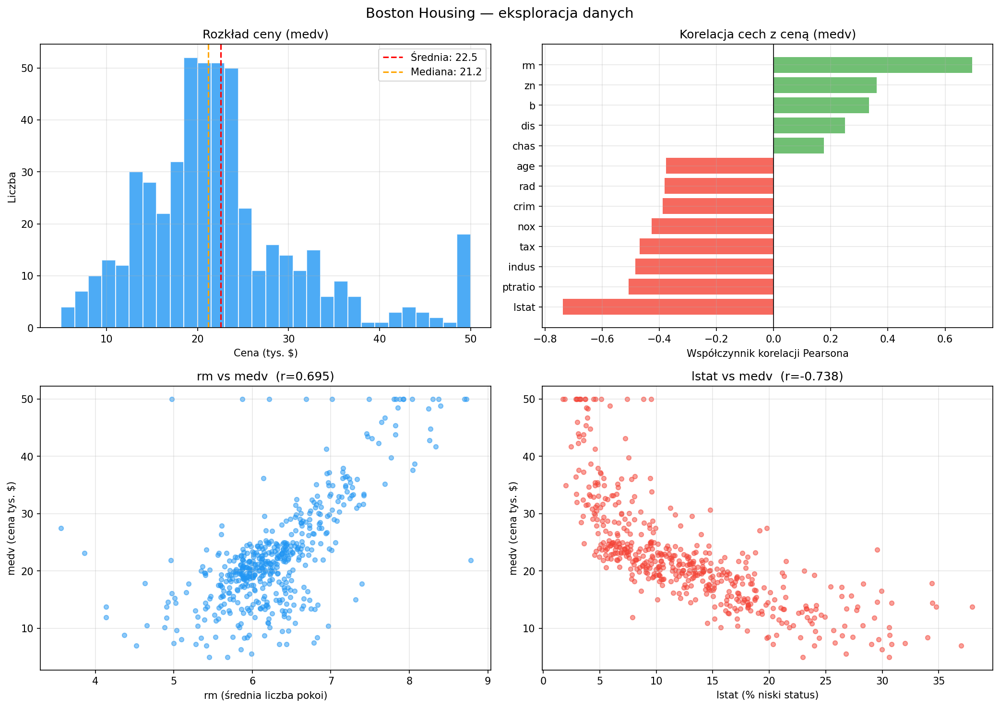

Najsilniejsze korelacje z ceną: `lstat` (r=-0.738, % ludności o niskim statusie)
i `rm` (r=0.695, liczba pokoi). Widoczna silna multikolinearność między
cechami: `tax`↔`rad` (r=0.91), `nox`↔`indus` (r=0.76).

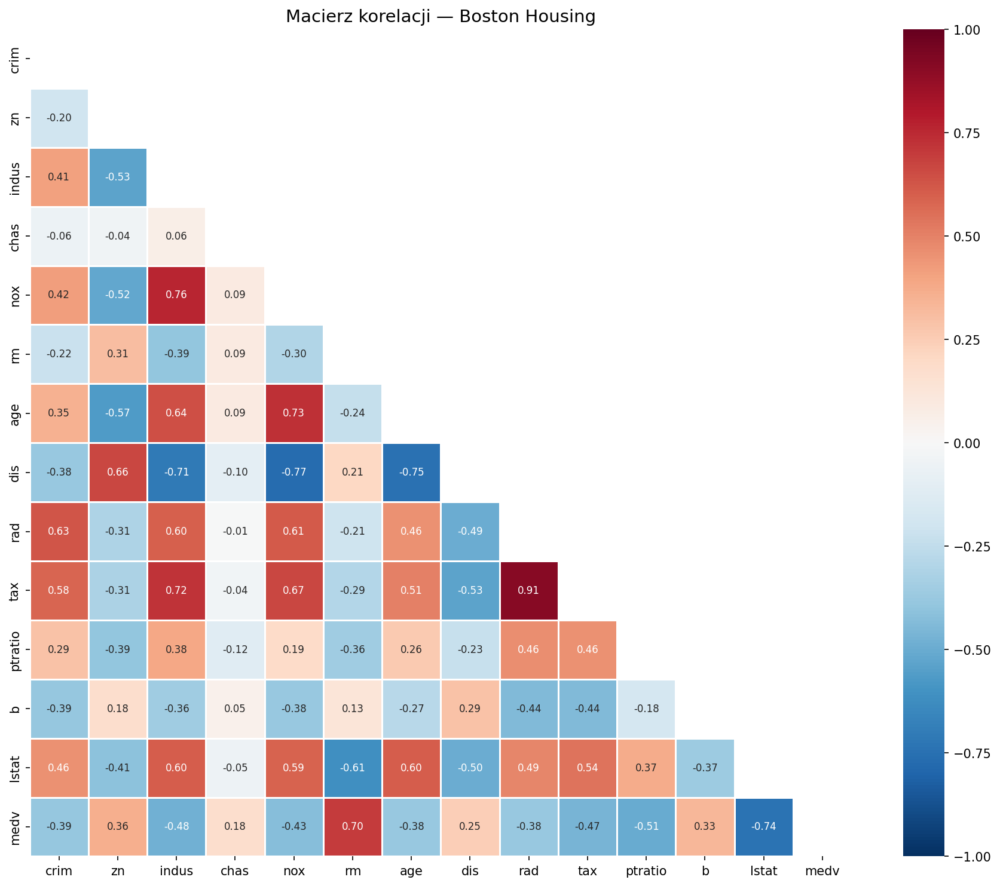

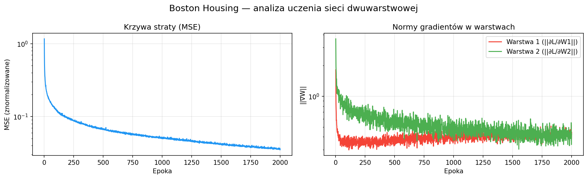

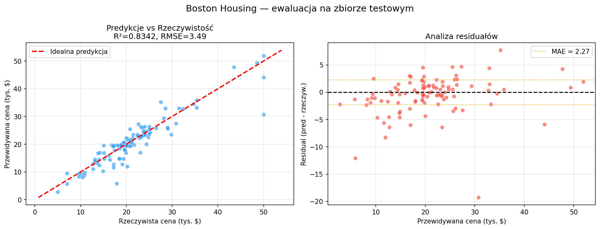

### Drzewo decyzyjne dla regresji

Zaimplementowano drzewo decyzyjne dla regresji używające **wariancji (MSE)**
jako kryterium podziału zamiast Gini:

<div class="math">gain = Var(rodzic) - Σ (|Sv|/|S|) × Var(Sv)</div>

Parametry: `max_depth=5`, `min_samples_split=10`.

### Porównanie: Drzewo decyzyjne vs Sieć neuronowa

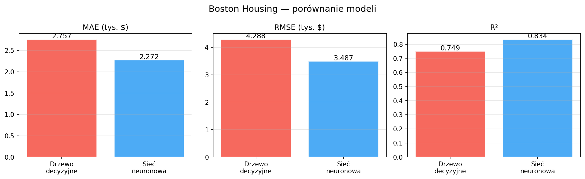

| Metryka | Drzewo decyzyjne | Sieć neuronowa | Poprawa |
|---------|-----------------|----------------|---------|
| MAE (tys. $) | 2.76 | **2.27** | -17.7% |
| RMSE (tys. $) | 4.29 | **3.49** | -18.6% |
| R² | 0.7492 | **0.8342** | +11.3% |

Sieć neuronowa przewyższa drzewo decyzyjne we wszystkich metrykach.
Model myli się średnio o **2 270 $** i wyjaśnia **83.4%** wariancji cen.
Drzewo (max_depth=5) osiąga R²=0.749 — ograniczenie głębokości zapobiega
overfittingowi kosztem dokładności. Sieć lepiej aproksymuje nieliniowe
zależności (np. zależność ceny od liczby pokoi jest nieliniowa).

---

# Sieć Konwolucyjna — MNIST

## Dataset

MNIST zawiera **70 000 obrazów** ręcznie pisanych cyfr (0-9) w skali szarości
28×28 pikseli. 60 000 treningowych, 10 000 testowych.

## Architektura CNN

```
Obraz 28×28×1
    ↓ Conv2D(32 filtry, 3×3) + ReLU  →  26×26×32
    ↓ MaxPool(2×2)                    →  13×13×32
    ↓ Conv2D(64 filtry, 3×3) + ReLU  →  11×11×64
    ↓ MaxPool(2×2)                    →   5×5×64
    ↓ Flatten + Dropout(0.25)         →  1600
    ↓ Linear(128) + ReLU + Dropout(0.5)
    ↓ Linear(10)  →  10 klas
Parametry łącznie: 225 034
```

CNN używa filtrów 3×3 przesuwanych po obrazie zamiast połączeń każdy-z-każdym.
Korzyści: wykrywanie lokalnych wzorców przestrzennych (krawędzie, krzywizny),
współdzielenie wag, niezmienniczość na przesunięcia.

**Trening:** Adam (lr=0.001), CrossEntropyLoss, 10 epok, batch=64.
**Sprzęt:** NVIDIA RTX 4070 Ti (CUDA 13.2).

## Wyniki

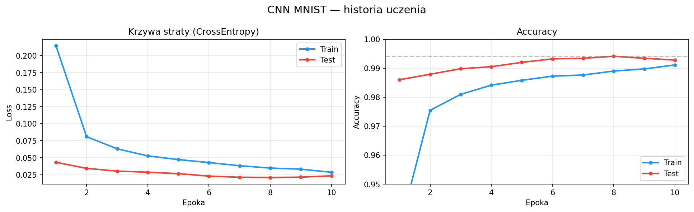

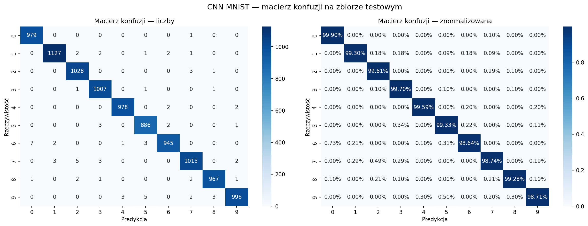

| Epoka | Train Acc | Test Acc |
|-------|-----------|----------|
| 1 | 93.44% | 98.60% |
| 5 | 98.53% | 99.19% |
| 10 | 99.00% | **99.41%** |

**Test accuracy: 99.41%** — 59 błędów na 10 000 obrazów.

Charakterystyczna obserwacja: test accuracy > train accuracy przez większość
treningu — efekt Dropout który podczas treningu losowo wyłącza neurony
(p=0.25, p=0.50), zaniżając pozornie accuracy treningowe. Podczas ewaluacji
Dropout jest wyłączony.

Najtrudniejsze cyfry: **5** (recall 99.33%), **4** (recall 99.59%) —
mylone z wizualnie podobnymi cyframi.

## Optymalizacja pipeline'u

Zidentyfikowano i usunięto dwa wąskie gardła:

| Optymalizacja | Problem | Przed | Po |
|---------------|---------|-------|-----|
| `num_workers` + `pin_memory` | CPU→GPU transfer | 2:30 min | **49 sek** |
| Algorytm wizualizacji | Iteracja po całym datasecie | 1:30 min | **0.9 sek** |

`num_workers` uruchamia równoległe procesy CPU do ładowania danych,
`pin_memory=True` przyspiesza transfer do pamięci GPU przez "przypięcie" RAM.
Liczba workerów dobierana automatycznie: `min(cpu_count(), 8)`.

---

# Głęboka Sieć Konwolucyjna — CIFAR-10

## Dataset i problem

CIFAR-10 zawiera **60 000 kolorowych obrazów** 32×32 pikseli w 10 klasach:
airplane, automobile, bird, cat, deer, dog, frog, horse, ship, truck.

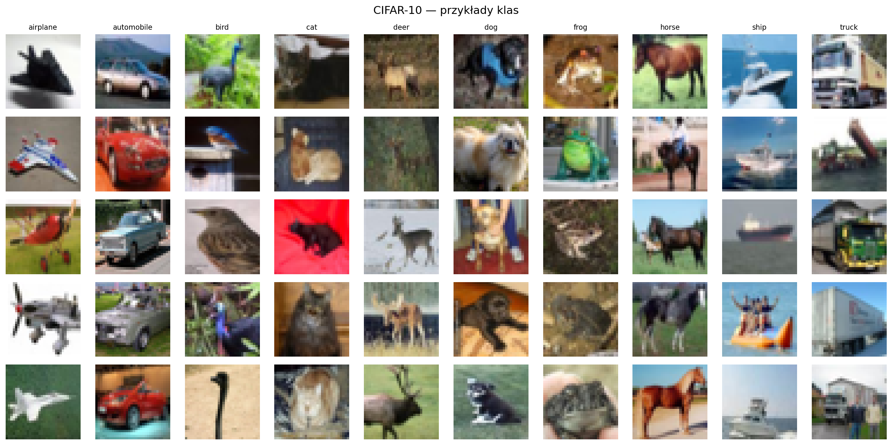

CIFAR-10 jest znacznie trudniejszy od MNIST ze względu na:

- Kolorowe obrazy (3 kanały RGB zamiast 1)
- Różnorodność wewnątrz klas (koty w różnych pozach, oświetleniu)
- Podobieństwo między klasami (cat vs dog, airplane vs bird)
- Małą rozdzielczość (32×32) przy złożonych obiektach

## Architektura — VGG-like

```
32×32×3
    ↓ [Conv(64,3×3) + BN + ReLU] × 2  →  MaxPool  →  16×16×64
    ↓ [Conv(128,3×3) + BN + ReLU] × 2  →  MaxPool  →  8×8×128
    ↓ [Conv(256,3×3) + BN + ReLU] × 2  →  MaxPool  →  4×4×256
    ↓ Flatten  →  Linear(512) + BN + ReLU + Dropout(0.5)
    ↓ Linear(10)  →  10 klas
Parametry łącznie: ~7 000 000
```

**Ulepszenia względem MNIST CNN:**

- **Batch Normalization** po każdej konwolucji — normalizuje aktywacje do N(0,1)
  w obrębie batcha, stabilizuje uczenie i pozwala na głębsze sieci
- **3 bloki konwolucyjne** zamiast 2 — głębsza hierarchia cech
- **Data Augmentation** — RandomHorizontalFlip + RandomCrop(32, padding=4)
  zapobiega overfittingowi przez różnicowanie obrazów treningowych
- **ReduceLROnPlateau** — zmniejsza lr o 50% gdy brak poprawy przez 5 epok

**Trening:** Adam (lr=0.001, weight_decay=1e-4), 50 epok, batch=128.
**Sprzęt:** NVIDIA RTX 4070 Ti, czas treningu: ~10 minut.

## Wyniki

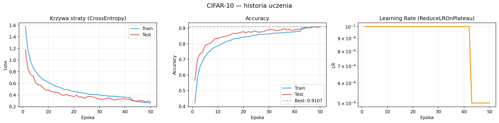

| Etap | Epoki | LR | Test Acc |
|------|-------|----|---------|
| Szybki wzrost | 1-10 | 0.001 | 56% → 83% |
| Wolna poprawa | 10-36 | 0.001 | 83% → 89% |
| Plateau | 36-42 | 0.001 | ~89% |
| Po redukcji LR | 43-50 | 0.0005 | 90% → **91.07%** |

Scheduler zmniejszył lr po epoce 42 — efekt natychmiastowy: skok accuracy
z 89.72% do 90.19%. Model oscylował wokół optimum ze zbyt dużym krokiem,
mniejszy lr pozwolił precyzyjniej go znaleźć.

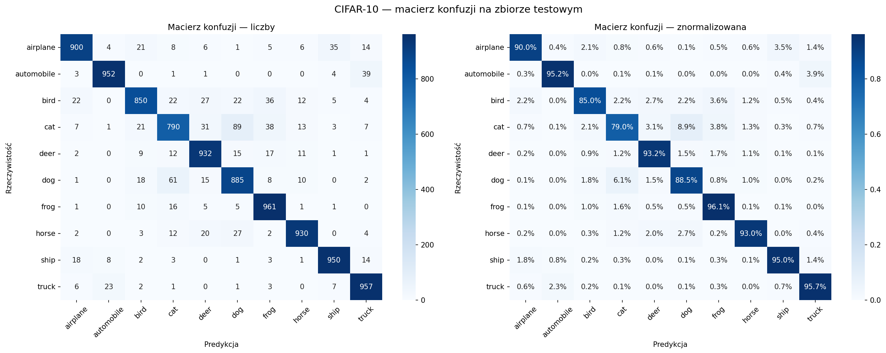

| Klasa | Recall | | Klasa | Recall |
|-------|--------|-|-------|--------|
| automobile | 95.20% | | cat | **79.00%** |
| frog | 96.10% | | dog | 88.50% |
| ship | 95.00% | | bird | 85.00% |

**Test accuracy: 91.07%** — 893 błędy na 10 000 obrazów.

Najtrudniejsza klasa: **cat** (recall 79.0%) — mylona głównie z psami (8.9%).
Intuicyjne przy rozdzielczości 32×32 gdzie detale sylwetki są słabo widoczne.

## Porównanie CNN: MNIST vs CIFAR-10

| | MNIST | CIFAR-10 |
|--|-------|----------|
| Architektura | 2 bloki conv | 3 bloki conv + BN |
| Parametry | 225 034 | ~7 000 000 |
| Epoki | 10 | 50 |
| Czas (RTX 4070 Ti) | 49 sek | ~10 min |
| Test accuracy | 99.41% | **91.07%** |

Różnica wyników (99.41% vs 91.07%) odzwierciedla realną trudność problemów.

---

# Podsumowanie

| Model | Problem | Metryka | Wynik |
|-------|---------|---------|-------|
| Naiwny Bayes | Subscribers — klasyfikacja | Accuracy | 64.4% |
| Drzewo decyzyjne | Subscribers — klasyfikacja | F1 (kl. 1) | 0.25 |
| Sieć 2→4→1 | XOR | Accuracy | 100% |
| Sieć 8→16→1 | Titanic — klasyfikacja | Accuracy | 77.65% |
| Drzewo decyzyjne (regresja) | Boston Housing | R² | 0.749 |
| Sieć 13→32→1 | Boston Housing — regresja | R² | **0.834** |
| CNN (225k param.) | MNIST — klasyfikacja obrazów | Accuracy | 99.41% |
| Głęboka CNN (~7M param.) | CIFAR-10 — klasyfikacja obrazów | Accuracy | **91.07%** |

Projekt potwierdza że głębokie sieci neuronowe przewyższają klasyczne metody
ML (Naiwny Bayes, Drzewo decyzyjne) na złożonych problemach, szczególnie
w klasyfikacji obrazów. Kluczowe techniki które pozwoliły osiągnąć dobre
wyniki to Batch Normalization, Data Augmentation i adaptacyjny learning rate
(ReduceLROnPlateau). Wszystkie modele zaimplementowano od zera z jawnymi
operacjami forward i backward — bez użycia gotowych implementacji z bibliotek.